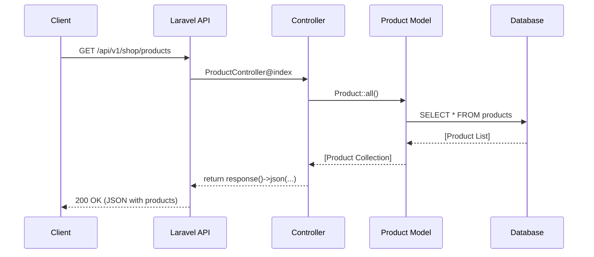

# توثيق بنية تطبيق Stronger Muscles

مرحباً بك في توثيق البنية التقنية لتطبيق Stronger Muscles. هذا الملف مصمم ليكون دليلاً للمطورين لفهم كيفية عمل التطبيق وأجزاءه المختلفة، وهو متوافق مع Obsidian لسهولة التنقل.

---

## نظرة عامة (Overview)

تطبيق Stronger Muscles هو عبارة عن منصة تجارة إلكترونية متكاملة (E-commerce) مصممة كـ **Headless API**. الغرض الأساسي منه هو بيع المنتجات المتعلقة بالصحة والرياضة، مثل المكملات الغذائية.

يقدم التطبيق واجهة برمجية (API) تسمح لأي تطبيق طرف ثالث (مثل تطبيق جوال أو موقع ويب) بالتفاعل مع البيانات، بما في ذلك:
- عرض المنتجات والفئات.
- إدارة المستخدمين والمصادقة.
- نظام متكامل لعربة التسوق ومعالجة الطلبات.
- لوحة تحكم للمدراء لإدارة أجزاء المتجر المختلفة.

---

## هيكلة المشروع (Folder Structure)

يعتمد المشروع على الهيكلة القياسية لإطار عمل [[Laravel]]. الأجزاء الأكثر أهمية للمطورين تقع داخل مجلد `app`:

-   `[[app/Http/Controllers]]`: يحتوي على وحدات التحكم (Controllers) التي تستقبل الطلبات (Requests) من المستخدمين وتنفذ المنطق المطلوب.
    -   `[[app/Http/Controllers/Api/V1]]`: هذا هو قلب التطبيق، حيث توجد وحدات التحكم الخاصة بالـ API. وهي مقسمة حسب الأدوار:
        -   `[[app/Http/Controllers/Api/V1/Admin]]`: للعمليات الخاصة بالمدير (مثل إضافة منتج).
        -   `[[app/Http/Controllers/Api/V1/Customer]]`: للعمليات الخاصة بالعميل (مثل إدارة عربة التسوق).
-   `[[app/Models]]`: يحتوي على نماذج Eloquent ORM التي تمثل جداول قاعدة البيانات (مثل `User`, `Product`, `Order`). هذه النماذج هي المسؤولة عن التفاعل مع قاعدة البيانات.
-   `[[app/Http/Middleware]]`: يحتوي على الوسطاء (Middleware) الذين يقومون بفلترة الطلبات قبل وصولها إلى وحدات التحكم، مثل التحقق من أن المستخدم هو مدير (`IsAdmin`).
-   `[[routes]]`: هنا يتم تعريف جميع مسارات (Routes) التطبيق. الملف الأهم في مشروعنا هو `[[routes/api.php]]` الذي يربط بين عناوين URL ووحدات التحكم.
-   `[[database]]`: يحتوي على كل ما يتعلق بقاعدة البيانات.
    -   `[[database/migrations]]`: لتعريف وتعديل هياكل جداول قاعدة البيانات.
    -   `[[database/factories]]`: لإنشاء بيانات وهمية لغرض الاختبار والتطوير.

---

## تدفق البيانات (Data Flow)

تدفق البيانات في هذا التطبيق يتبع نمط (Request-Response Lifecycle) القياسي في Laravel API:

1.  **الطلب (Request)**: يقوم العميل (تطبيق الويب أو الجوال) بإرسال طلب HTTP (مثل `GET`, `POST`) إلى أحد نقاط النهاية (Endpoints) المعرفة في `[[routes/api.php]]`.
2.  **التوجيه (Routing)**: يقوم Laravel بتوجيه الطلب إلى وحدة التحكم (Controller) والطريقة (Method) المناسبة.
3.  **الوسيط (Middleware)**: قبل الوصول إلى وحدة التحكم، قد يمر الطلب عبر وسيط أو أكثر (مثل `auth:sanctum` للتحقق من هوية المستخدم أو `isAdmin` للتحقق من صلاحيات المدير).
4.  **وحدة التحكم (Controller)**: تقوم وحدة التحكم بمعالجة الطلب. قد تتفاعل مع نماذج `[[app/Models]]` لجلب البيانات من قاعدة البيانات أو تخزينها.
5.  **النموذج (Model)**: يتفاعل نموذج Eloquent مع قاعدة البيانات لجلب البيانات المطلوبة أو تنفيذ عمليات (Create, Update, Delete).
6.  **الاستجابة (Response)**: تقوم وحدة التحكم بإرجاع استجابة، والتي تكون عادةً بصيغة `JSON`، تحتوي على البيانات المطلوبة أو رسالة نجاح/فشل.

**مثال: عرض المنتجات**

---

## إدارة الحالة (State Management)

بما أن هذا التطبيق هو API (عديم الحالة - Stateless)، فإن "إدارة الحالة" تتمحور بشكل أساسي حول **المصادقة والتفويض (Authentication & Authorization)**.

-   **التقنية المستخدمة**: `[[laravel/sanctum]]`.
-   **آلية العمل**:
    1.  يقوم المستخدم بتسجيل الدخول عبر نقطة نهاية مثل `[[/api/v1/auth/login]]`.
    2.  إذا كانت بيانات الدخول صحيحة، يقوم Sanctum بإنشاء Token فريد للمستخدم.
    3.  يقوم العميل بتخزين هذا الـ Token وإرساله مع كل طلب لاحق في ترويسة `Authorization` كـ `Bearer Token`.
    4.  يستخدم الوسيط `auth:sanctum` هذا الـ Token للتحقق من هوية المستخدم وتحديد صلاحياته في كل طلب يتطلب مصادقة.

---

## المكونات الرئيسية (Key Components)

### 1. النماذج (Models)
-   `[[app/Models/User.php]]`: يمثل المستخدمين وصلاحياتهم (عميل أو مدير).
-   `[[app/Models/Product.php]]`: يمثل المنتجات بكل تفاصيلها من سعر، كمية، صور، وصف، إلخ. يحتوي على علاقات مع الفئات والطلبات.
-   `[[app/Models/Category.php]]`: يمثل فئات المنتجات.
-   `[[app/Models/Order.php]]`: يمثل طلب العميل، ويحتوي على تفاصيل مثل حالة الطلب، عنوان الشحن، والمبلغ الإجمالي.
-   `[[app/Models/OrderItem.php]]`: يمثل منتجاً واحداً داخل طلب معين.
-   `[[app/Models/CartItem.php]]`: يمثل منتجاً داخل عربة تسوق العميل.

### 2. وحدات التحكم (Controllers)
-   `[[app/Http/Controllers/Api/V1/Admin/ProductController.php]]`: مسؤول عن عمليات CRUD (Create, Read, Update, Delete) الخاصة بالمنتجات من قبل المدير.
-   `[[app/Http/Controllers/Api/V1/Customer/CartController.php]]`: يسمح للعميل بإضافة المنتجات إلى عربة التسوق، عرضها، تحديث الكميات، أو حذفها.
-   `[[app/Http/Controllers/Api/V1/Customer/OrderController.php]]`: يسمح للعميل بإنشاء طلب جديد من خلال عربة التسوق وعرض طلباته السابقة.
-   `[[app/Http/Controllers/Api/V1/AuthController.php]]`: يحتوي على منطق تسجيل الدخول، إنشاء حساب جديد، وتحديث ملف المستخدم.

### 3. المسارات (Routes)
-   `[[routes/api.php]]`: هو الملف المركزي الذي يعرف جميع نقاط النهاية للـ API ويقسمها بشكل منطقي وواضح حسب الصلاحيات (Admin, Customer, Public).
